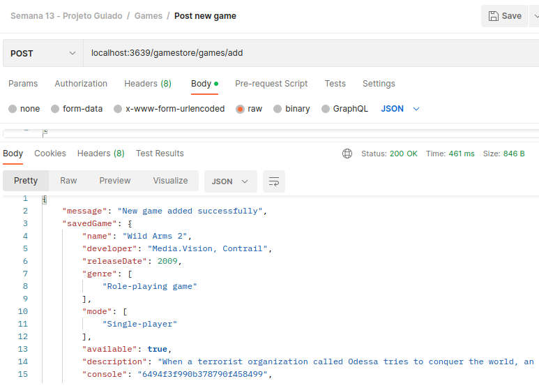

# Exercício de Casa 🏫  

## Nome do Exercicio
<h1 align="center">
  
</h1>
- Explicação do exercício: 
* Termine o codigo, caso tenha faltado alguma informação;
* Crie uma rota **GET** que encontre um jogo usando como parametro  *name* (crie a logica na pasta controller);
* Crie uma rota **GET** que encontre um console usando como parametro *available* (crie a logica na pasta controller);
* Cadastre no seu banco de dados um novo jogo e/ou um novo console (a sua escolha), tire um print da tela e adicione essa imagem no seu **README.md** isso servirá como comprovante pessoal de que todo seu codigo esta funcionando. 
* Opicional (não conta como avaliação): Crie uma **rota GET** para *genre* em jogos e uma **rota GET** para *developer* em consoles.
---

Terminou o exercício? Dá uma olhada nessa checklist e confere se tá tudo certinho, combinado?!

- [x] Fiz o fork do repositório.
- [x] Clonei o fork na minha máquina (`git clone url-do-meu-fork`).
- [x] Resolvi o exercício.
- [x] Adicionei as mudanças. (`git add .` para adicionar todos os arquivos, ou `git add nome_do_arquivo` para adicionar um arquivo específico)
- [x] Commitei a cada mudança significativa ou na finalização do exercício (`git commit -m "Mensagem do commit"`)
- [x] Pushei os commits na minha branch (`git push origin nome-da-branch`)
